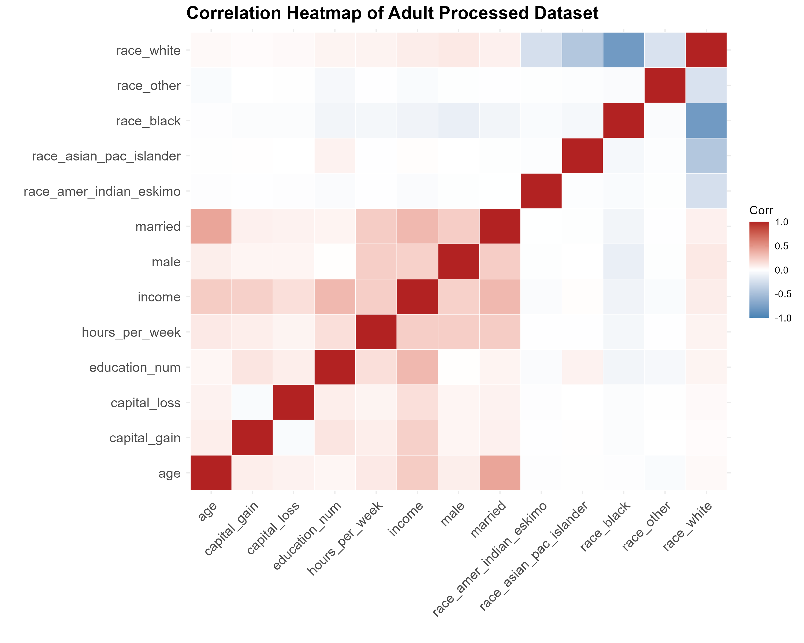
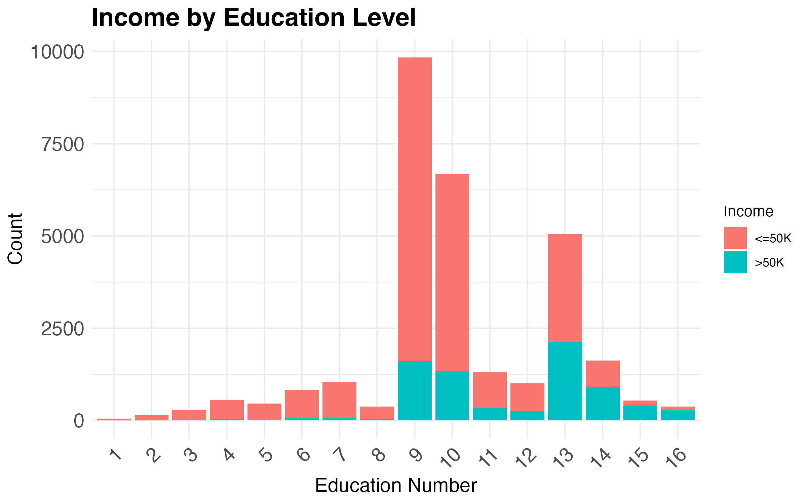
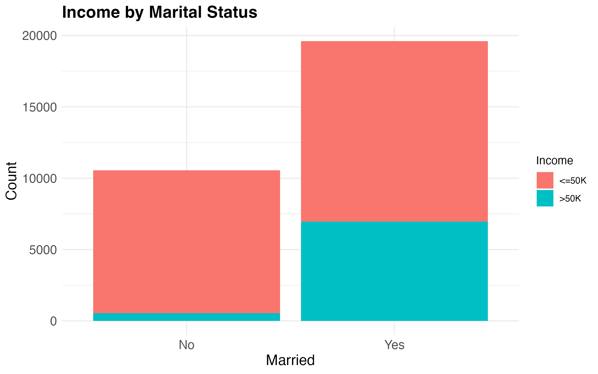
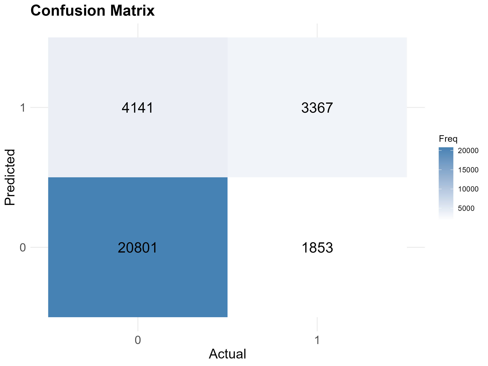
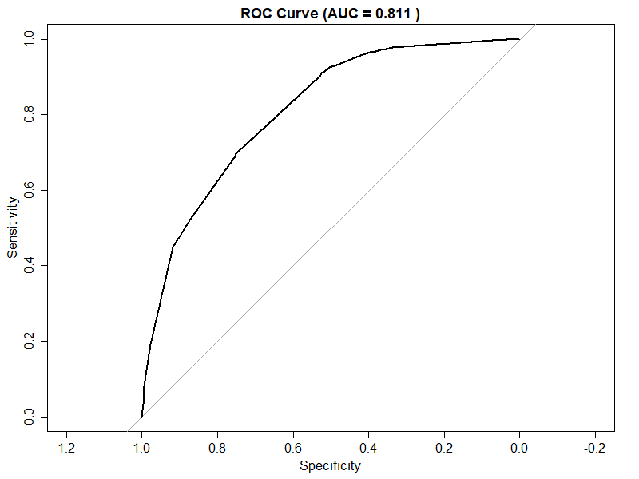

```{r}
#| label: setup
#| include: false

library(dplyr)
library(knitr)

class_counts     <- read.csv("../tables/class_counts.csv")
training_metrics <- read.csv("../tables/training_metrics.csv")

accuracy <- round(
  training_metrics$value[training_metrics$metric == "accuracy"],
  4
)
auc_val <- 0.811

n_total       <- sum(class_counts$n)
n_low_income  <- class_counts$n[class_counts$income == 0]
n_high_income <- class_counts$n[class_counts$income == 1]
prop_low      <- round(class_counts$prop[class_counts$income == 0] * 100, 1)
prop_high     <- round(class_counts$prop[class_counts$income == 1] * 100, 1)
```

## Summary

We applied a logistic regression model on the 1994 UCI Adult Census dataset to predict
whether an individual earns ≤\$50K or >\$50K a year. The model achieved an accuracy of
`r accuracy * 100`%. One of the patterns we found from our exploratory data analysis was
that education and income appear to be positively correlated — as the education level of an
individual increases, their income tends to increase. Another important correlation was
between marital status and income, where married individuals were more likely to earn
>\$50K compared to non-married individuals. The findings from this analysis can be used to
influence education and other social policies. Due to the strong performance of this model it can also serve as a template 
for similar work in economic research. These patterns are reflected directly in the model — `education_num` and `married` were selected as predictors 
based on their strong correlations with income observed in the EDA,and the model's AUC of 0.811 confirms that these two features carry 
meaningful predictive signal.

## Introduction

Income is influenced by a mix of personal and labour-market factors such as education,
occupation, and hours worked. Predicting whether someone earns above a given threshold is
a common classification problem in data science and also raises practical questions about
how demographic and job characteristics relate to earnings outcomes.

This project uses the UCI Adult (Census Income) dataset [@becker1996adult] to build and
evaluate a model that predicts whether an individual's annual income exceeds \$50K using
demographic and work-related features (e.g., age, education, occupation, hours worked per
week). The dataset contains *48,842* observations and *14* input features (6 quantitative
and 8 categorical), with the target variable indicating whether income exceeds \$50K. UCI
also notes that records were selected using the following conditions:

- Age > 16
- Adjusted gross income (AGI) > 100
- Final weight (AFNLWGT) > 1
- Hours worked per week (HRSWK) > 0

## Methods & Results

### Data Wrangling Summary

Since the original data does not include column names, descriptive variable names were
manually assigned based on the dataset documentation. The data was then cleaned by removing
observations containing missing or undefined values (represented by `"?"`) in key
categorical variables such as workclass, occupation, and native country, as well as
filtering out individuals who had never worked. Several categorical variables were
transformed into binary indicator variables to make the dataset more suitable for
quantitative analysis and modelling, including indicators for marital status, sex, and race
categories. The target variable, income, was converted into a binary numeric outcome where
1 represents individuals earning more than \$50K annually and 0 otherwise. Finally,
redundant or highly categorical variables that were no longer needed after encoding were
removed, resulting in a cleaned, analysis-ready data frame composed primarily of numeric
predictors and selected categorical information.

### Analysis Summary

We conducted exploratory data analysis including a visualization of the class distribution
between >\$50K and ≤\$50K income groups (@tbl-class-counts), as well as a correlation
matrix (@fig-heatmap) to help inform variable selection. Once we isolated our variables of
interest, we fit a simple logistic regression to conduct our classification experiment.

@tbl-class-counts shows the class distribution in the processed dataset. The dataset is
notably imbalanced: `r prop_low`% of individuals earn ≤\$50K (`r n_low_income` records)
compared to only `r prop_high`% earning >\$50K (`r n_high_income` records).
```{r}
#| label: tbl-class-counts
#| tbl-cap: "Class distribution of income in the processed Adult Census dataset."
#| echo: false

class_counts |>
  mutate(
    income = ifelse(income == 0, "<=50K", ">50K"),
    prop   = round(prop * 100, 2)
  ) |>
  rename(
    `Income Group` = income,
    `Count`        = n,
    `Proportion (%)` = prop
  ) |>
  knitr::kable()
```

@fig-heatmap shows the correlation among all numeric variables in the processed dataset.
The `education_num` and `married` variables hold the strongest associations with the
response variable `income`, which informed our variable selection for the classification
task. We also noted that these two predictors are not highly correlated with each other,
which is a positive sign for the model.
```{r}
#| label: fig-heatmap
#| fig-cap: "Correlation heatmap of the Adult processed dataset."
#| echo: false
#| out-width: "90%"


```

@fig-eda shows the distribution of income across education levels and marital status.
Higher education levels correspond to a greater proportion of individuals in the >\$50K
category, suggesting that education level provides useful predictive signal. Similarly,
married individuals have a higher proportion of >\$50K earners compared to those who are
not married. It is important to note that these observations are descriptive and do not
imply causal relationships — they highlight patterns that the predictive model can leverage
when classifying individuals into income groups.
```{r}
#| label: fig-eda
#| fig-cap: "Distribution of income by education level (left) and marital status (right) in the Adult dataset."
#| echo: false
#| out-width: "90%"


```
```{r}
#| label: fig-marriage
#| fig-cap: "Distribution of income by marital status in the Adult dataset."
#| echo: false
#| out-width: "60%"


```

We fit a logistic regression model using `education_num` and `married` as predictors of
`income`. The model achieved an overall accuracy of `r accuracy * 100`%.

@fig-confusion presents the confusion matrix for the logistic regression model. The model
correctly classified 20,801 individuals in the ≤\$50K category and 3,367 in the >\$50K
category. However, it misclassified 4,141 high-income individuals as low-income (false
negatives) and 1,853 low-income individuals as high-income (false positives). These
results indicate that the model performs better at predicting the ≤\$50K class, with lower
sensitivity in identifying high-income earners.
```{r}
#| label: fig-confusion
#| fig-cap: "Confusion matrix for logistic regression on the Adult dataset."
#| echo: false
#| out-width: "80%"


```

@fig-roc shows the ROC curve for the logistic regression model. An AUC of `r auc_val`
indicates that the model is able to correctly rank higher-income individuals above
lower-income individuals in most cases, demonstrating good discriminative performance
across different classification thresholds.
```{r}
#| label: fig-roc
#| fig-cap: "ROC curve for logistic regression on the Adult dataset."
#| echo: false
#| out-width: "70%"


```

## Discussion

We applied a logistic regression model to predict whether an individual earns ≤\$50K or
>\$50K annually. The model achieved an accuracy of `r accuracy * 100`%, indicating strong
predictive performance. Additionally, the AUC is `r auc_val` (see @fig-roc), suggesting
that the model is effective at distinguishing between lower- and higher-income individuals.

From the exploratory visualizations (see @fig-eda and @fig-marriage), certain variables
appear to contribute meaningfully to the model's predictive performance:

- **Education level**: Higher education levels are associated with a greater proportion of
  individuals predicted as earning >\$50K, suggesting that this variable is useful in
  distinguishing between income groups [@strober1990].
- **Marital status**: Married individuals are more frequently predicted as earning >\$50K,
  indicating that this feature provides predictive signal for the model [@cutright1970].

As shown in @fig-confusion, while overall performance is strong, the model performs better
at predicting individuals in the ≤\$50K class than those in the >\$50K class. This
imbalance is likely influenced by the class distribution in the dataset (see
@tbl-class-counts), where lower-income individuals are more prevalent, causing the model
to be better calibrated toward the majority class.

**Potential implications:**

- **Predictive utility**: With an AUC of `r auc_val`, the model demonstrates reasonable
  effectiveness for predicting income categories and could serve as a baseline for similar
  classification tasks [@rosenblum2025].
- **Feature relevance**: Variables such as education level and marital status appear to
  provide useful predictive information and may be important inputs for future models.

**Future directions:**

- Would more complex models (e.g., random forests or gradient boosting) improve prediction,
  particularly for high-income individuals?
- How can class imbalance be addressed to improve sensitivity for the >\$50K class?
- Does predictive performance vary across demographic subgroups such as gender, race, or
  age [@tan2026]?

## References